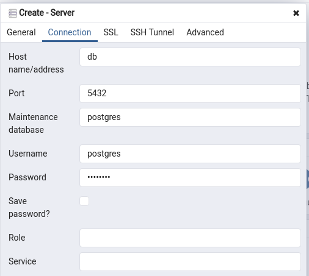

# Adonis fullstack application

This is the fullstack boilerplate for AdonisJs, it comes pre-configured with.

1. Bodyparser
2. Session
3. Authentication
4. Web security middleware
5. CORS
6. Edge template engine
7. Lucid ORM
8. Migrations and seeds

## PostgreSQL & pgAdmin 4 Docker

- Run: `docker-compose up -d`

- Accessing pgAdmin4: `http://localhost:15432`
> Use PGADMIN_DEFAULT_EMAIL and PGADMIN_DEFAULT_PASSWORD to login

- Steps to configure pgAdmin4:





## Start

Starting AdonisJS server

```bash
adonis serve --dev
```

## Setup

Use the adonis command to install the blueprint

```bash
adonis new yardstick
```

or manually clone the repo and then run `npm install`.


### Migrations

Run the following command to run startup migrations.

```js
adonis migration:run
```
